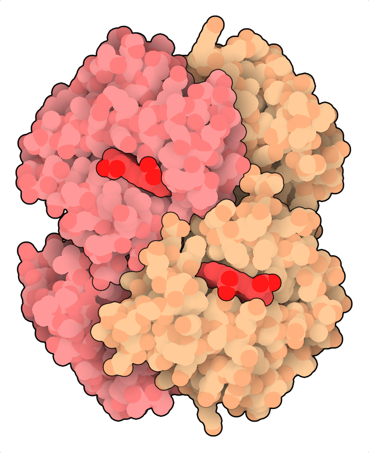
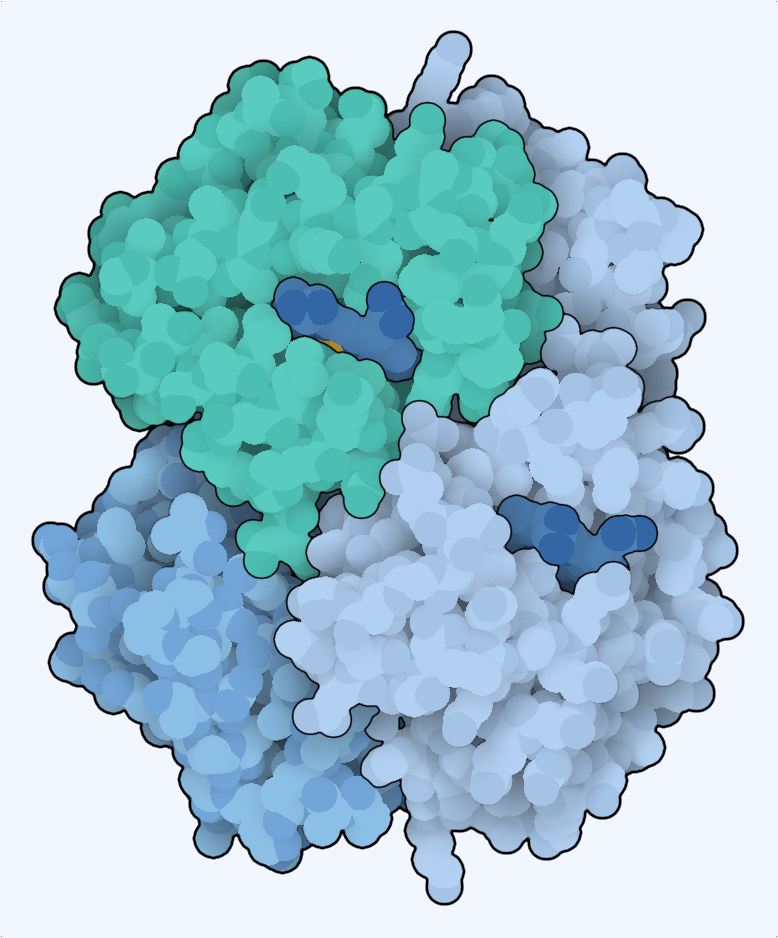
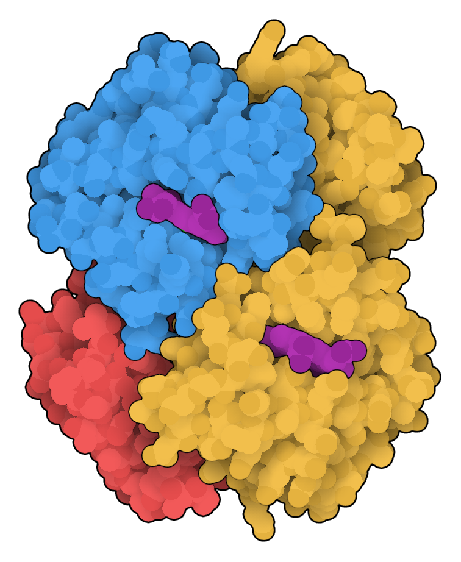
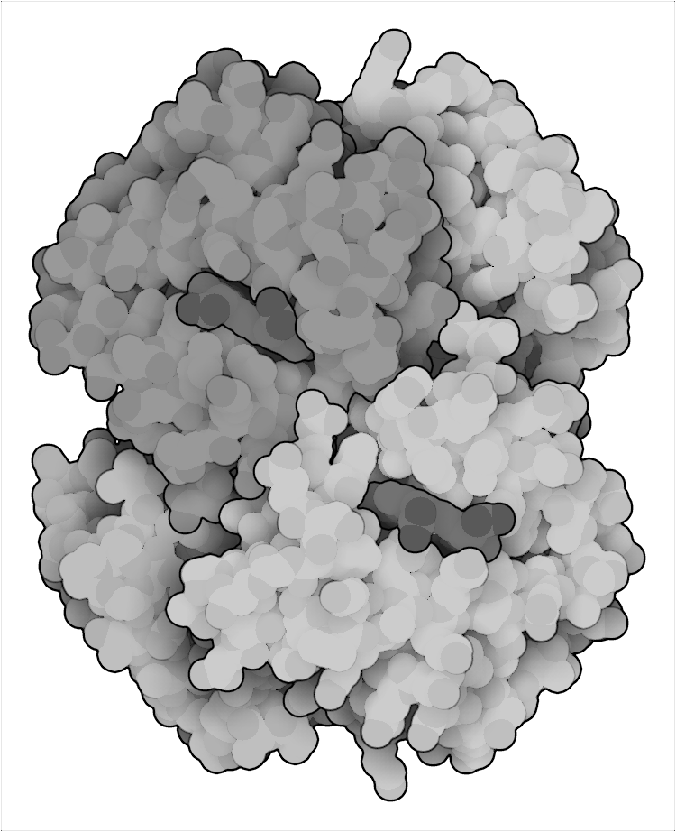
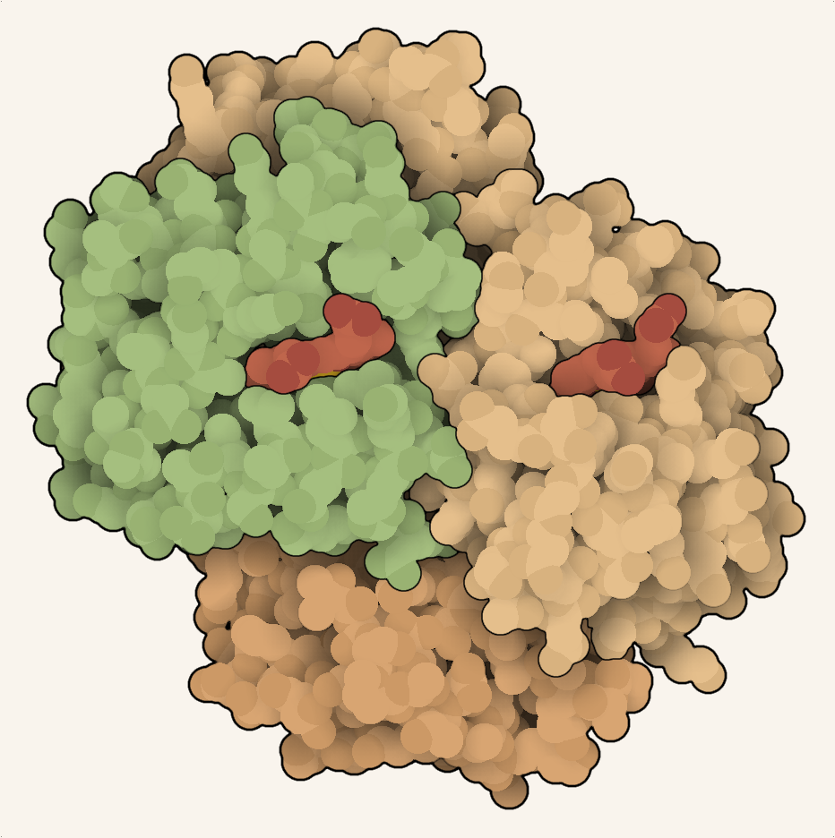
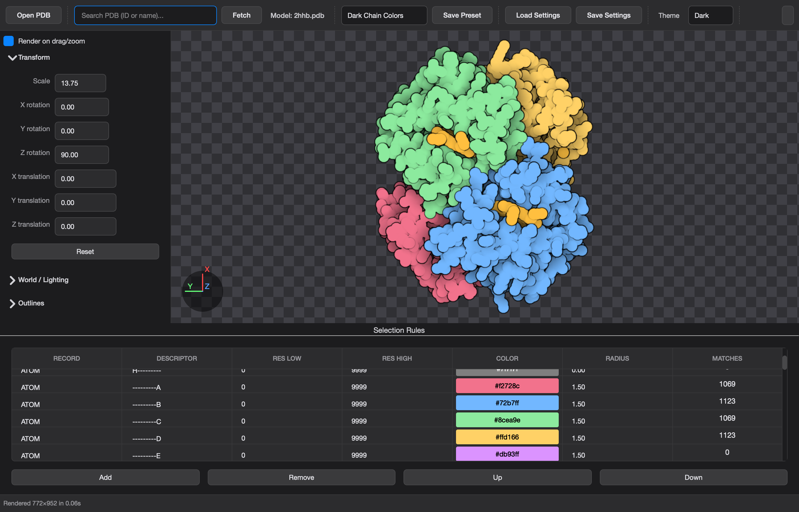

<p align="center">
  
</p>

<h1 align="center">Illustrate</h1>

<p align="center">
  Beautiful, publication-ready molecular artwork from protein structures.<br>
  Load a PDB file. Pick a style. Export a PNG. No scripting required.
</p>

<p align="center">
  <a href="https://opensource.org/licenses/Apache-2.0"></a>
  <a href="https://www.python.org"></a>
</p>

---

<p align="center">
  
  
  
  
</p>

<p align="center">
  <sub>Cool Blues · High Contrast · Pen &amp; Ink · Earth Tones — 8 built-in presets, all customizable</sub>
</p>

---

## Desktop app

<p align="center">
  
</p>

A full desktop GUI built on PySide6. Drag to rotate, scroll to zoom, tweak colors and outlines per-chain, and export when you're happy.

- Load `.pdb` files from disk or fetch directly by RCSB ID
- 8 built-in style presets with live preview
- Fine-grained control over selection rules, lighting, and outlines
- One-click PNG export at any resolution

### Install and launch

```bash
git clone https://github.com/Alfredo-Sandoval/Illustrate.git
cd Illustrate
make start
```

`make start` is the non-developer path. It auto-installs `micromamba` (if needed), creates the managed environment, installs the GUI runtime, and launches the app.

On macOS, you can also double-click `Illustrate.command` from Finder for the same flow.

If you only want to install without launching:

```bash
make install-desktop
```

> **Packaged installers** (`.dmg` / `.zip`) will be available from [GitHub Releases](https://github.com/Alfredo-Sandoval/Illustrate/releases) soon.

---

## Quick render from Python

```python
from illustrate import render, write_png
from illustrate.presets import render_params_from_preset

params = render_params_from_preset("Cool Blues", "data/2hhb.pdb")
result = render(params)
write_png("hemoglobin.png", result.rgb)
```

Three lines from PDB to PNG.

---

## Available presets

| Preset            | Background | Look                                   |
| ----------------- | ---------- | -------------------------------------- |
| Default           | White      | Classic Goodsell illustration          |
| Black Background  | Black      | Dark theme variant                     |
| Wireframe         | White      | Sharper outlines, more surface detail  |
| Dark Chain Colors | Near-black | Chain-aware palette on dark background |
| Cool Blues        | Pale blue  | Steel-blue and teal palette            |
| High Contrast     | White      | Saturated red/blue/amber palette       |
| Pen & Ink         | White      | Grayscale with heavier outlines        |
| Earth Tones       | Warm cream | Sandstone and sage palette             |

---

## Documentation

Full docs — Python API, selection rules, command file format, CLI reference, Jupyter workflows, web API, and architecture notes:

**[illustrate.readthedocs.io](https://illustrate.readthedocs.io)** &nbsp;·&nbsp; or build locally with `mkdocs serve`

Key pages: [Getting Started](docs/getting-started.md) · [Desktop GUI](docs/guide/gui.md) · [Selection Rules](docs/guide/selection-rules.md) · [Presets](docs/guide/presets.md) · [API Reference](docs/reference.md) · [Troubleshooting](docs/troubleshooting.md)

---

## Background

David S. Goodsell originally wrote Illustrate in Fortran at The Scripps Research Institute (released 2019). This is a Python reimplementation that keeps command-file compatibility and adds desktop and web frontends on the same rendering core.

> DS Goodsell & AJ Olson (1992) "Molecular Illustration in Black and White" _J Mol Graphics_ 10, 235-240.

## License

[Apache 2.0](LICENSE)
